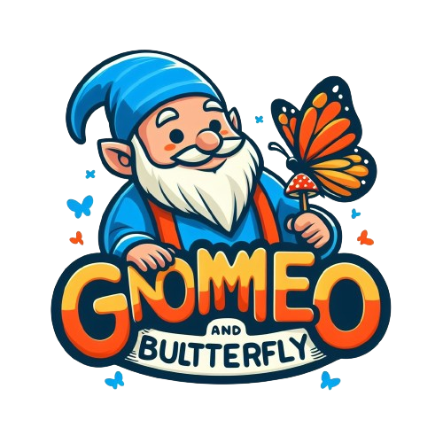

# 2D Platformer By PandaSaurus Studio

> This project involves participating in the Indie Game Jam hosted by the [VARLab](https://www.linkedin.com/company/varlab-virtual-and-augmented-reality-lab/) at Conestoga College.

The PandaSaurus Studio is a team of 10 developers and designers.
Our goal was to produce a 2D game with content and design that appeals to players of all ages, following the theme of "non-violent". We demonstrated skills in implementing game mechanics using C# and Unity Engine, creating game assets and managing the project process on DevOps following Agile Methodology.

## How To Play

https://topchickenturtle.itch.io/gnomeo-and-the-butterfly

## Game Trailor

## Project History

- **Development Period:** Feb/27/2024 - Mar/01/2024

## Development Environment

- **Programming Language:** `C#`
- **Game Engine:** `Unity`
- **Version Control System:** `Git & GitHub`
- **Project Management:** [`Azure DevOps`](https://dev.azure.com/pandasaurusTEAM/2D_Platformer)
- **IDE:** `Visual Studio`

## Features Implemented

- Player Movement
- Collision Detection
- Player-Item Interaction
- Dynamic Items/Traps Movement
- Item Collecting Effects
- Collecting Scores
- Game Completion/Failure Conditions

## Contributors (Alphabetical Order)

- Alexander Philippopoulos
- Chloe Feierabend
- Dahyun Ko
- Dylan Seitz
- Gabriel Siewert
- Jindo Kim
- Johnstanley Ajagu
- Josh Lane-smith
- Juhwan Seo
- Miles Purvis
